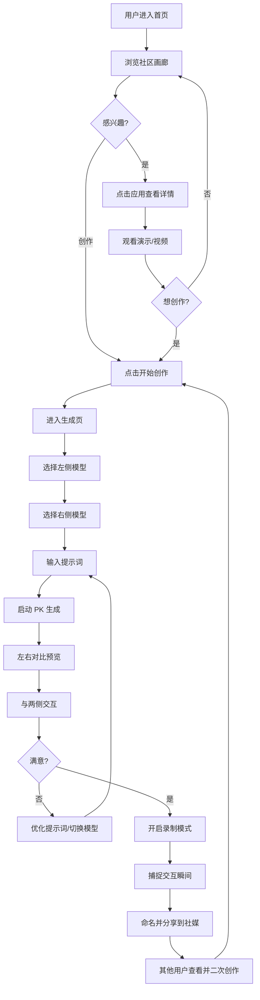

# Novita Arena - 产品概览

**版本**: 1.1
**最后更新**: 2025-01-09
**产品名称**: Novita Arena
**状态**: 设计阶段

---

## 目录

1. [产品概述](#1-产品概述)
2. [核心功能](#2-核心功能)
3. [用户体验与流程](#3-用户体验与流程)
4. [开发路线图](#4-开发路线图)
5. [成功指标](#5-成功指标)

---

## 1. 产品概述

### 1.1 产品定义

**Novita Arena** 是一个基于 Web App 视觉生成的 AI 对比与传播社区平台，让用户通过自然语言提示词生成交互式 Web 应用，同时对比不同 AI 模型的能力表现。

### 1.2 核心价值主张

- **降低开发门槛**: 让任何人都能无需编码即可创建交互式 Web 应用
- **模型对比**: 直观展示不同大语言模型的代码生成和审美能力
- **社区驱动**: 展示并分享 AI 生成的创作，构建开发者社区
- **流量入口**: 通过引人入胜的病毒式内容为 Novita API 平台引流

### 1.3 目标用户

- **主要用户**: 对 AI 代码生成能力感兴趣的开发者
- **次要用户**: AI/ML 爱好者和技术发烧友
- **第三用户**: 评估 AI 模型用于开发任务的技术决策者

---

## 2. 核心功能

### 2.1 创作模块

#### 基于 Prompt 的生成
- 用户输入自然语言描述想要的 Web 应用
- 系统调用 Novita LLM 服务生成完整的前端项目代码
- **约束**: 用户不能直接编辑生成的代码（零代码体验）

#### 技术栈白名单
为防止依赖地狱并确保稳定性，限制 LLM 仅使用指定库：
- **构建工具**: Vite
- **UI框架**: React
- **UI库**: shadcn/ui
- **图标**: Lucide React
- **图表**: Recharts
- **动画**: Framer Motion
- **时间**: Day.js
- **网络请求**: Axios
- **状态管理**: Zustand
- **交互表单**: React Hook Form
- **3D 渲染**: React Three Fiber (Three.js in React)
- **3D 工具函数**: @react-three/drei
- **物理引擎**: @react-three/rapier (Rapier in React)
- **2D 物理/酷炫**: Matter.js
- **粒子/烟花**: Canvas-confetti

素材:
- **图片素材**: https://images.unsplash.com/... (Unsplash) 或 https://picsum.photos/ (快速占位图)
- **头像素材**: https://i.pravatar.cc/ (随机头像)

#### 自动构建与托管
- 系统自动处理依赖安装、构建和部署
- 为每个创作生成唯一可分享的访问 URL
- 用户无需手动部署

### 2.2 竞技模块

#### 双模型 PK 模式
- 同一提示词同时发送给两个不同的 AI 模型
- 左右分屏实时对比生成结果
- 并行生成，流式显示双模型进度
- 相同约束和技术栈确保公平对比
- 支持自由切换模型组合（Claude vs GPT-4、Claude Sonnet vs Claude Opus 等）

#### 交互对比
- 用户可与两侧应用交互
- 每侧独立的全屏和刷新功能
- 对比 UI 差异、功能实现、性能表现

### 2.3 分享模块

#### 社区画廊
- 只有用户点击分享到画廊的才可见
- 允许用户点赞和复制提示词
- 分类: 热门、最新
   - 热门（初期）：官方精选 + 社区优秀案例
   - 热门（后期）：社区点赞量
   - 最新：用户分享的最新应用

#### 视频录制
- 基于 MediaRecorder API 的浏览器录制
- 导出为可分享的视频文件
- 可一键分享到 X, LinkedIn, Email

#### 一键复制
- 复制任何应用的提示词重新生成
- 支持在现有想法基础上迭代改进

### 2.4 账户模块

#### 统一认证
- 与 Novita 账户系统打通
- 单点登录体验

#### 额度与使用
- 基于 Credit 的消费模型
- 清晰展示使用情况和剩余额度
- 额度耗尽时弹出升级提示

---

## 3. 用户体验与流程

### 3.1 主要用户旅程

### 3.1.1 用户旅程说明

**核心设计理念**：专注于 PK 对比体验，所有功能围绕"模型竞技"展开。降低用户门槛，提供智能输入引导。

**阶段 1: 发现灵感**
- 用户在首页浏览社区精选的 PK 案例
- 观看其他用户的创作（静态缩略图）
- 点击"开始创作"进入生成页

**阶段 2: 快速配置对战**
- **智能输入引导**：
  - 选择灵感（如"时钟"、"游戏"、"数据可视化"）
  - 选择效果库（如"3D效果 > 粒子系统"）
  - 或直接输入自己的创意
- **默认模型配置**：
  - 左侧模型：默认 Claude 3.5 Sonnet
  - 右侧模型：默认 GPT-4o
  - 用户可直接点击"开始 PK"使用默认配置
  - 也可自定义选择模型组合

**阶段 3: 实时对比**
- 左右分屏同时生成两个模型的结果
- 用户与两侧应用交互，对比效果
- 可以优化提示词重新 PK，或切换模型组合

**阶段 4: 录制与分享**
- 开启录制模式捕捉精彩交互
- 录制时只读提示词显示在顶部，作为附加信息
- LLM 自动生成应用名称
- 分享到社交媒体或社区画廊
- 其他用户可以查看 PK 结果并二次创作

### 3.2 关键用户状态

#### 生成状态
- 预览区显示生成状态
- 流式显示模型思考输出
- 清晰的进度指示器
- 生成错误时友好提示

#### 空状态
- 未输入提示词时显示"灵感卡片"
- 示例: "构建一个 3D 时钟"、"创建粒子系统"、"制作扫雷游戏"
- 降低首次创作的门槛

---

## 4. 开发路线图

### 4.1 阶段规划

#### 阶段 1: PoC (Proof of Concept)
**目标**: 验证核心概念可行性
- 时间: 2 周
- 功能:
  - 单模型生成（Claude 或 GPT-4）
  - 简单的提示词输入
  - 基础的预览功能
  - 手动录制视频

#### 阶段 2: 单模型模式
**目标**: 完善用户体验
- 时间: 3 周
- 功能:
  - 优化生成流程
  - 添加智能输入引导（灵感选择）
  - 改进预览交互
  - 基础分享功能

#### 阶段 3: 对战模式
**目标**: 核心功能上线
- 时间: 4 周
- 功能:
  - 双模型 PK 生成
  - 左右分屏对比
  - 模型切换功能
  - 社区画廊（官方精选）

#### 阶段 4: 录制与分享
**目标**: 病毒式传播机制
- 时间: 3 周
- 功能:
  - 自动录制功能
  - LLM 自动命名
  - 社交分享优化
  - 用户生成内容展示

### 4.2 里程碑

| 里程碑 | 目标 | 成功标准 |
|--------|------|----------|
| **M1: PoC 完成** | 验证技术可行性 | 成功生成 5+ 个可运行的应用 |
| **M2: 单模型上线** | 内测版本发布 | 50+ 内测用户，生成率 > 60% |
| **M3: 对战模式上线** | 公测版本发布 | 500+ 用户，社交分享 > 50 次 |
| **M4: 完整功能上线** | 正式版本发布 | 5000+ 活跃用户，社区案例 > 100 个 |

---

## 5. 成功指标

### 5.1 关键绩效指标 (KPIs)

#### 用户参与度
- **活跃用户**: 5,000+ 用户与 Model Arena 互动
- **画廊浏览量**: 社区画廊总页面浏览量
- **生成率**: 每用户平均生成应用数量

#### 内容与病毒传播
- **社交分享**: X (Twitter) 上 100+ 用户生成的 Vibe Coding 案例
- **Fork 率**: 画廊应用被 Fork/二次创作的百分比
- **视频导出**: 录制并分享的视频数量

#### 转化
- **注册率**: 匿名用户创建账户的百分比
- **额度使用率**: 每用户平均消耗额度
- **升级率**: 用户购买额外额度的百分比

#### 技术
- **生成成功率**: 成功生成可运行应用的提示词百分比
- **平均生成时间**: 从提示词提交到可部署 URL 的时间
- **正常运行时间**: 活跃时段的平台可用性

### 5.2 测量工具

- **分析**: 页面浏览、用户流程、转化漏斗
- **数据库追踪**: 应用生成计数、模型使用分布
- **社交监控**: 话题标签提及、分享追踪
- **性能监控**: API 响应时间、错误率

---

## 相关文档

- **技术实现**: 详见 [01-技术规范.md](./01-技术规范.md)
- **页面设计**: 详见 [02-页面规范.md](./02-页面规范.md)
- **运营设计**: 详见 [03-运营与设计.md](./03-运营与设计.md)
