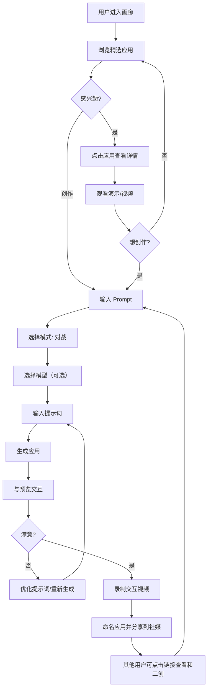

# Novita Arena - 产品需求文档 (PRD)

**版本**: 1.1
**最后更新**: 2025-01-09
**产品名称**: Novita Arena
**状态**: 设计阶段

---

## 目录

1. [产品概述](#1-产品概述)
2. [核心功能](#2-核心功能)
3. [用户体验与流程](#3-用户体验与流程)
4. [设计规范](#4-设计规范)
5. [技术架构](#5-技术架构)
6. [数据库设计](#6-数据库设计)
7. [API 接口概览](#7-api-接口概览)
8. [页面规范](#8-页面规范)
9. [开发环境配置](#9-开发环境配置)
10. [开发路线图](#10-开发路线图)
11. [成功指标](#11-成功指标)

---

## 1. 产品概述

### 1.1 产品定义

**Novita Arena** 是一个基于 Web App 视觉生成的 AI 对比与传播社区平台，让用户通过自然语言提示词生成交互式 Web 应用，同时对比不同 AI 模型的能力表现。

### 1.2 核心价值主张

- **降低开发门槛**: 让任何人都能无需编码即可创建交互式 Web 应用
- **模型对比**: 直观展示不同大语言模型的代码生成和审美能力
- **社区驱动**: 展示并分享 AI 生成的创作，构建开发者社区
- **流量入口**: 通过引人入胜的病毒式内容为 Novita API 平台引流

### 1.3 目标用户

- **主要用户**: 对 AI 代码生成能力感兴趣的开发者
- **次要用户**: AI/ML 爱好者和技术发烧友
- **第三用户**: 评估 AI 模型用于开发任务的技术决策者

---

## 2. 核心功能

### 2.1 创作模块

#### 基于 Prompt 的生成
- 用户输入自然语言描述想要的 Web 应用
- 系统调用 Novita LLM 服务生成完整的前端项目代码
- **约束**: 用户不能直接编辑生成的代码（零代码体验）

#### 技术栈白名单
为防止依赖地狱并确保稳定性，限制 LLM 仅使用指定库：
- **构建工具**: Vite
- **UI框架**: React
- **UI库**: shadcn/ui
- **图标**: Lucide React
- **图表**: Recharts
- **动画**: Framer Motion
- **时间**: Day.js
- **网络请求**: Axios
- **状态管理**: Zustand
- **交互表单**: React Hook Form
- **3D 渲染**: React Three Fiber (Three.js in React)
- **3D 工具函数**: @react-three/drei
- **物理引擎**: @react-three/rapier (Rapier in React)
- **2D 物理/酷炫**: Matter.js
- **粒子/烟花**: Canvas-confetti
素材:
- **图片素材**: https://images.unsplash.com/... (Unsplash) 或 https://picsum.photos/ (快速占位图)。
- **头像素材**: https://i.pravatar.cc/ (随机头像)。

#### 自动构建与托管
- 系统自动处理依赖安装、构建和部署
- 为每个创作生成唯一可分享的访问 URL
- 用户无需手动部署

### 2.2 竞技模块

#### 多模型对战模式
- 同一提示词发送给 2+ 个不同 AI 模型（或同一模型的不同版本）
- 不可以连续对话，但可修改提示词重新生成
- 并行生成以实现实时对比
- 相同约束和技术栈确保公平对比
- 可在对战界面切换对比模型

#### 对比视图

**桌面端**:
- 左右分屏对比
- 可拖动分隔线调整查看比例

**移动端**:
- Tab 切换或轮播模式（非分屏）
- 优化触控交互

### 2.3 分享模块

#### 社区画廊
- 只有用户点击分享到画廊的才可见
- 允许用户点赞和复制提示词
- 分类: 热门、最新
   - 热门（初期）：官方精选 + 社区优秀案例
   - 热门（后期）：社区点赞量
   - 最新：用户分享的最新应用

#### 视频录制
- 基于 MediaRecorder API 的浏览器录制
- 导出为可分享的视频文件
- 可一键分享到X, LinkedIn, Email

#### 一键复制
- 复制任何应用的提示词重新生成
- 支持在现有想法基础上迭代改进

### 2.4 账户模块

#### 统一认证
- 与 Novita 账户系统打通
- 单点登录体验

#### 额度与使用
- 基于 Credit 的消费模型
- 清晰展示使用情况和剩余额度
- 额度耗尽时弹出升级提示

---

## 3. 用户体验与流程

### 3.1 主要用户旅程



### 3.2 关键用户状态

#### 生成状态
- 预览区显示生成状态
- 流式显示模型思考输出
- 清晰的进度指示器
- 生成错误时友好提示

#### 空状态
- 未输入提示词时显示"灵感卡片"
- 示例: "构建一个 3D 时钟"、"创建粒子系统"、"制作扫雷游戏"

---

## 4. 技术架构

### 4.1 整体架构

本产品参考 **E2B Fragments** 的设计思路，采用前后端统一的 Node.js 技术栈。

```
┌─────────────────────────────────────────────────────────────┐
│                         前端层                               │
├─────────────────────────────────────────────────────────────┤
│  Next.js 15+  │  React 19+  │  Tailwind CSS  │  shadcn/ui  │
└─────────────────────────────────────────────────────────────┘
                              ↓
┌─────────────────────────────────────────────────────────────┐
│                      API 路由层                              │
├─────────────────────────────────────────────────────────────┤
│  Next.js API Routes  │  认证中间件  │  速率限制 │  文件上传    │
└─────────────────────────────────────────────────────────────┘
                              ↓
┌─────────────────────────────────────────────────────────────┐
│                      业务逻辑层                              │
├─────────────────────────────────────────────────────────────┤
│  沙盒管理  │  代码生成  │  账户/余额            │
└─────────────────────────────────────────────────────────────┘
                              ↓
┌─────────────────────────────────────────────────────────────┐
│                    外部服务集成                              │
├─────────────────────────────────────────────────────────────┤
│  Novita LLM  │  Novita Sandbox  │  Novita Auth ｜ 文件存储 │
└─────────────────────────────────────────────────────────────┘
                              ↓
┌─────────────────────────────────────────────────────────────┐
│                      数据存储层                              │
├─────────────────────────────────────────────────────────────┤
│  Supabase (PostgreSQL)  │  AWS S3  │  CDN                   │
└─────────────────────────────────────────────────────────────┘
```

### 5.2 技术选型

#### 前端技术栈

| 技术 | 版本/说明 | 用途 |
|------|----------|------|
| **Next.js** | 15+ | 全栈框架，前后端统一 |
| **React** | 19+ | UI 框架 |
| **TypeScript** | 5.x | 类型安全 |
| **Tailwind CSS** | 4.x | 样式系统 |
| **shadcn/ui** | Latest | UI 组件库 |
| **Lucide Icons** |lucide-react | 图标库 |

#### 后端技术栈

| 技术 | 说明 | 用途 |
|------|------|------|
| **Next.js API Routes** | 服务端 API | 业务逻辑处理 |
| **Novita LLM** | 外部服务 | AI 代码生成 |
| **Novita Sandbox** | 外部服务 | 代码执行与构建 |
| **Novita Auth** | 外部服务 | 统一认证 |

#### 数据与存储

| 技术 | 说明 | 用途 |
|------|------|------|
| **Supabase** | PostgreSQL | 主数据库 |
| **AWS S3** | 对象存储 | 视频、代码包存储 |

### 5.3 核心设计理念

#### 参考 E2B Fragments

E2B Fragments 的核心特点：
1. **代码片段沙箱执行**: 在隔离环境中安全执行用户代码
2. **实时预览**: 即时反馈代码执行结果
3. **模板系统**: 预定义代码模板加速开发
4. **版本控制**: 每个片段都有版本历史

我们的借鉴：
- **沙箱隔离**: 使用 Novita Sandbox 隔离执行生成的代码
- **实时预览**: iframe 预览 + WebSocket 实时更新
- **代码模板**: 预设技术栈模板（Vite + Three.js 等）
- **版本管理**: 每次生成保存完整快照

### 5.4 生成流程

```
1. 用户输入 Prompt
   ↓
2. 前端调用 Next.js API (POST /api/generate)
   ↓
3. API 验证用户认证与额度
   ↓
4. 调用 Novita LLM 服务生成代码
   ↓
5. 启动 Novita Sandbox
   ↓
6. 获取 Novita Sandbox Host URL
   ↓
7. 返回预览 URL 给前端
   ↓
8. 前端 iframe 加载预览
```

---

## 6. 数据库设计

TODO

---

## 7. API 接口概览

TODO

---

## 8. 页面规范

### 8.1 社区画廊（首页）

**目的**: 展示最惊艳的 AI 生成内容以激发用户灵感

**布局**:

| 区域 | 组件 | 交互 |
|------|------|------|
| **顶部导航** | Logo、导航菜单、用户头像 | Logo → 首页; 头像 → 账户 |
| **Hero 区** | 大标题居中: "Generate anything, Share the magic." | 简洁启发式标语 |
| **内容网格** | 响应式瀑布流布局 | 24px 卡片间距 |

**应用卡片组件**:

1. **视频预览区** (顶部):
   - 16:9 纵横比
   - 悬停时自动播放录制片段
   - 点击查看详情

2. **标题区**:
   - 应用名称
   - 创作者署名

3. **模型徽章**:
   - 显示模型名称
   - 按模型颜色编码

4. **操作栏**:
   - 复制按钮
   - 点赞/心形图标

### 8.2 创作 Playground

**目的**: 核心生成与对比环境

**布局**:

#### 顶部控制栏
- **中间**: 模型选择器
  - 对战模式: 两个下拉菜单，中间夹 "VS" 图标
  - 单模型模式: 单个下拉菜单
- **右侧**:
  - 录制按钮（红色圆圈图标）
  - 分享按钮

#### 主预览区

**对战模式**:
- 屏幕水平分割（50/50）
- 左侧: 模型 A 生成的应用
- 右侧: 模型 B 生成的应用
- 可拖动分隔线手柄
- 浮动按钮: 全屏、刷新

**单模型模式**:
- 应用居中，占据大部分屏幕
- 与对战模式相同的浮动按钮

#### 底部输入控制台
- 浮动在屏幕底部中央
- 宽度: 约屏幕的 60%
- 多行输入框（自动扩展）
- 右侧发送按钮（生成时变为停止图标）
- 下方微型文字: "正在使用 React + TailwindCSS 生成..."

### 8.3 录制模式遮罩

**目的**: 引导用户捕捉最佳时刻

**UI 元素**:
- **遮罩效果**: 非预览区域变暗
- **录制 HUD**:
  - 计时器显示（例如 "00:05"）
  - [完成] 按钮 → 停止并预览
  - [取消] 按钮 → 取消录制
- **视觉反馈**:
  - 预览区周围红色虚线动画边框
  - 录制指示器脉冲

### 8.4 分享与导出弹窗

**目的**: 快速导出和社交分享

**布局**:

**左侧（预览）**:
- 16:9 视频播放器
- 循环播放录制的片段

**右侧（配置）**:
- 应用名称输入框
- 社交分享按钮: X (Twitter), TikTok, LinkedIn（大图标）
- 下载 MP4 按钮
- 复制直链按钮

---

## 9. 开发环境配置

TODO

---

## 10. 开发路线图

TODO

---

## 11. 成功指标

### 11.1 关键绩效指标 (KPIs)

#### 用户参与度
- **活跃用户**: 5,000+ 用户与 Model Arena 互动
- **画廊浏览量**: 社区画廊总页面浏览量
- **生成率**: 每用户平均生成应用数量

#### 内容与病毒传播
- **社交分享**: X (Twitter) 上 100+ 用户生成的 Vibe Coding 案例
- **Fork 率**: 画廊应用被 Fork/二次创作的百分比
- **视频导出**: 录制并分享的视频数量

#### 转化
- **注册率**: 匿名用户创建账户的百分比
- **额度使用率**: 每用户平均消耗额度
- **升级率**: 用户购买额外额度的百分比

#### 技术
- **生成成功率**: 成功生成可运行应用的提示词百分比
- **平均生成时间**: 从提示词提交到可部署 URL 的时间
- **正常运行时间**: 活跃时段的平台可用性

### 11.2 测量工具

- **分析**: 页面浏览、用户流程、转化漏斗
- **数据库追踪**: 应用生成计数、模型使用分布
- **社交监控**: 话题标签提及、分享追踪
- **性能监控**: API 响应时间、错误率

---

## 12. 运营需求

### 12.1 内容审核

- **审核队列**: 标记潜在不当生成内容的系统
- **社区准则**: 明确的生成应用使用政策
- **申诉流程**: 用户申诉审核决定的机制

### 12.2 基础设施准备

- **可扩展性**: 处理峰值时段的并发生成请求
- **速率限制**: 在保持良好 UX 的同时防止滥用
- **成本监控**: 追踪每用户的 API 成本以确保可持续性

### 12.3 客户支持

- **帮助文档**: 清晰的 FAQ 和使用指南
- **问题报告**: 便捷的错误或生成失败报告方式
- **反馈循环**: 用户提出改进建议的机制

---

## 13. 设计原则

### 13.1 代码 vs 结果
- **默认**: 不显示代码
- **重点**: 所有空间专用于视觉 Web App 结果
- **可选**: 代码视图可切换供感兴趣的用户查看

### 13.2 录制清洁度
- 确保录制捕获"干净画布"
- 从录制区域排除 UI 按钮和控件
- 设计录制友好的预览区域

### 13.3 移动端响应式
- 画廊: 单栏卡片布局
- Playground: 对战模式使用 Tab 切换（非左右并排）
- 触控优化控件

### 13.4 空状态
- 未输入提示词时显示"灵感卡片"
- 建议创意起点
- 降低首次创作的门槛

---

## 附录 A: 参考资源

### 设计资源
- 设计文档: `/docs/design-system/`

### 技术文档
- Next.js: https://nextjs.org/docs
- Tailwind CSS: https://tailwindcss.com/docs
- Lucide Icons: https://lucide.dev
- Supabase: https://supabase.com/docs
- E2B Fragments: https://github.com/e2b-dev/fragments

### 灵感来源
- LlamaCoder: https://llamacoder.together.ai/
- Animate Anyone: https://animateanyoneai.ai/
