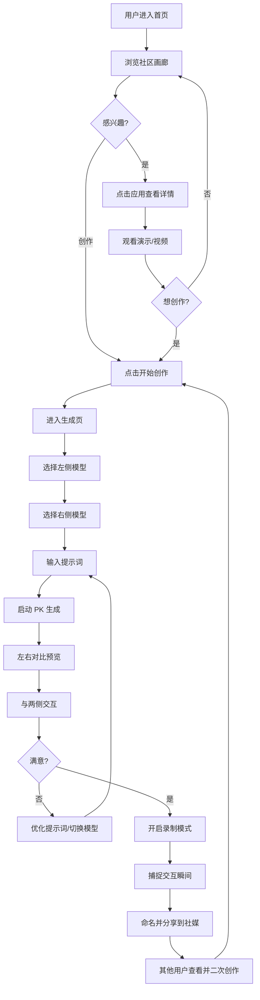

# Novita Arena - 产品需求文档 (PRD)

**版本**: 1.1
**最后更新**: 2025-01-09
**产品名称**: Novita Arena
**状态**: 设计阶段

---

## 目录

1. [产品概述](#1-产品概述)
2. [核心功能](#2-核心功能)
3. [用户体验与流程](#3-用户体验与流程)
4. [设计规范](#4-设计规范)
5. [技术架构](#5-技术架构)
6. [数据库设计](#6-数据库设计)
7. [API 接口概览](#7-api-接口概览)
8. [页面规范](#8-页面规范)
9. [开发环境配置](#9-开发环境配置)
10. [开发路线图](#10-开发路线图)
11. [成功指标](#11-成功指标)

---

## 1. 产品概述

### 1.1 产品定义

**Novita Arena** 是一个基于 Web App 视觉生成的 AI 对比与传播社区平台，让用户通过自然语言提示词生成交互式 Web 应用，同时对比不同 AI 模型的能力表现。

### 1.2 核心价值主张

- **降低开发门槛**: 让任何人都能无需编码即可创建交互式 Web 应用
- **模型对比**: 直观展示不同大语言模型的代码生成和审美能力
- **社区驱动**: 展示并分享 AI 生成的创作，构建开发者社区
- **流量入口**: 通过引人入胜的病毒式内容为 Novita API 平台引流

### 1.3 目标用户

- **主要用户**: 对 AI 代码生成能力感兴趣的开发者
- **次要用户**: AI/ML 爱好者和技术发烧友
- **第三用户**: 评估 AI 模型用于开发任务的技术决策者

---

## 2. 核心功能

### 2.1 创作模块

#### 基于 Prompt 的生成
- 用户输入自然语言描述想要的 Web 应用
- 系统调用 Novita LLM 服务生成完整的前端项目代码
- **约束**: 用户不能直接编辑生成的代码（零代码体验）

#### 技术栈白名单
为防止依赖地狱并确保稳定性，限制 LLM 仅使用指定库：
- **构建工具**: Vite
- **UI框架**: React
- **UI库**: shadcn/ui
- **图标**: Lucide React
- **图表**: Recharts
- **动画**: Framer Motion
- **时间**: Day.js
- **网络请求**: Axios
- **状态管理**: Zustand
- **交互表单**: React Hook Form
- **3D 渲染**: React Three Fiber (Three.js in React)
- **3D 工具函数**: @react-three/drei
- **物理引擎**: @react-three/rapier (Rapier in React)
- **2D 物理/酷炫**: Matter.js
- **粒子/烟花**: Canvas-confetti
素材:
- **图片素材**: https://images.unsplash.com/... (Unsplash) 或 https://picsum.photos/ (快速占位图)。
- **头像素材**: https://i.pravatar.cc/ (随机头像)。

#### 自动构建与托管
- 系统自动处理依赖安装、构建和部署
- 为每个创作生成唯一可分享的访问 URL
- 用户无需手动部署

### 2.2 竞技模块

#### 双模型 PK 模式
- 同一提示词同时发送给两个不同的 AI 模型
- 左右分屏实时对比生成结果
- 并行生成，流式显示双模型进度
- 相同约束和技术栈确保公平对比
- 支持自由切换模型组合（Claude vs GPT-4、Claude Sonnet vs Claude Opus 等）

#### 交互对比
- 用户可与两侧应用交互
- 每侧独立的全屏和刷新功能
- 对比 UI 差异、功能实现、性能表现

### 2.3 分享模块

#### 社区画廊
- 只有用户点击分享到画廊的才可见
- 允许用户点赞和复制提示词
- 分类: 热门、最新
   - 热门（初期）：官方精选 + 社区优秀案例
   - 热门（后期）：社区点赞量
   - 最新：用户分享的最新应用

#### 视频录制
- 基于 MediaRecorder API 的浏览器录制
- 导出为可分享的视频文件
- 可一键分享到X, LinkedIn, Email

#### 一键复制
- 复制任何应用的提示词重新生成
- 支持在现有想法基础上迭代改进

### 2.4 账户模块

#### 统一认证
- 与 Novita 账户系统打通
- 单点登录体验

#### 额度与使用
- 基于 Credit 的消费模型
- 清晰展示使用情况和剩余额度
- 额度耗尽时弹出升级提示

---

## 3. 用户体验与流程

### 3.1 主要用户旅程



### 3.1.1 用户旅程说明

**核心设计理念**：专注于 PK 对比体验，所有功能围绕"模型竞技"展开。降低用户门槛，提供智能输入引导。

**阶段 1: 发现灵感**
- 用户在首页浏览社区精选的 PK 案例
- 观看其他用户的创作（静态缩略图）
- 点击"开始创作"进入生成页

**阶段 2: 快速配置对战**
- **智能输入引导**：
  - 选择灵感（如"时钟"、"游戏"、"数据可视化"）
  - 选择效果库（如"3D效果 > 粒子系统"）
  - 或直接输入自己的创意
- **默认模型配置**：
  - 左侧模型：默认 Claude 3.5 Sonnet
  - 右侧模型：默认 GPT-4o
  - 用户可直接点击"开始 PK"使用默认配置
  - 也可自定义选择模型组合

**阶段 3: 实时对比**
- 左右分屏同时生成两个模型的结果
- 用户与两侧应用交互，对比效果
- 可以优化提示词重新 PK，或切换模型组合

**阶段 4: 录制与分享**
- 开启录制模式捕捉精彩交互
- 录制时只读提示词显示在顶部，作为附加信息
- LLM 自动生成应用名称
- 分享到社交媒体或社区画廊
- 其他用户可以查看 PK 结果并二次创作

### 3.2 关键用户状态

#### 生成状态
- 预览区显示生成状态
- 流式显示模型思考输出
- 清晰的进度指示器
- 生成错误时友好提示

#### 空状态
- 未输入提示词时显示"灵感卡片"
- 示例: "构建一个 3D 时钟"、"创建粒子系统"、"制作扫雷游戏"

---

## 4. 技术架构

### 4.1 整体架构

本产品参考 **E2B Fragments** 的设计思路，采用前后端统一的 Node.js 技术栈。

```
┌─────────────────────────────────────────────────────────────┐
│                         前端层                               │
├─────────────────────────────────────────────────────────────┤
│  Next.js 15+  │  React 19+  │  Tailwind CSS  │  shadcn/ui  │
└─────────────────────────────────────────────────────────────┘
                              ↓
┌─────────────────────────────────────────────────────────────┐
│                      API 路由层                              │
├─────────────────────────────────────────────────────────────┤
│  Next.js API Routes  │  认证中间件  │  速率限制 │  文件上传    │
└─────────────────────────────────────────────────────────────┘
                              ↓
┌─────────────────────────────────────────────────────────────┐
│                      业务逻辑层                              │
├─────────────────────────────────────────────────────────────┤
│  沙盒管理  │  代码生成  │  账户/余额            │
└─────────────────────────────────────────────────────────────┘
                              ↓
┌─────────────────────────────────────────────────────────────┐
│                    外部服务集成                              │
├─────────────────────────────────────────────────────────────┤
│  Novita LLM  │  Novita Sandbox  │  Novita Auth ｜ 文件存储 │
└─────────────────────────────────────────────────────────────┘
                              ↓
┌─────────────────────────────────────────────────────────────┐
│                      数据存储层                              │
├─────────────────────────────────────────────────────────────┤
│  Supabase (PostgreSQL)  │  AWS S3  │  CDN                   │
└─────────────────────────────────────────────────────────────┘
```

### 5.2 技术选型

#### 前端技术栈

| 技术 | 版本/说明 | 用途 |
|------|----------|------|
| **Next.js** | 15+ | 全栈框架，前后端统一 |
| **React** | 19+ | UI 框架 |
| **TypeScript** | 5.x | 类型安全 |
| **Tailwind CSS** | 4.x | 样式系统 |
| **shadcn/ui** | Latest | UI 组件库 |
| **Lucide Icons** |lucide-react | 图标库 |

#### 后端技术栈

| 技术 | 说明 | 用途 |
|------|------|------|
| **Next.js API Routes** | 服务端 API | 业务逻辑处理 |
| **Novita LLM** | 外部服务 | AI 代码生成 |
| **Novita Sandbox** | 外部服务 | 代码执行与构建 |
| **Novita Auth** | 外部服务 | 统一认证 |

#### 数据与存储

| 技术 | 说明 | 用途 |
|------|------|------|
| **Supabase** | PostgreSQL | 主数据库 |
| **AWS S3** | 对象存储 | 视频、代码包存储 |

### 5.3 核心设计理念

#### 参考 E2B Fragments

E2B Fragments 的核心特点：
1. **代码片段沙箱执行**: 在隔离环境中安全执行用户代码
2. **实时预览**: 即时反馈代码执行结果
3. **模板系统**: 预定义代码模板加速开发
4. **版本控制**: 每个片段都有版本历史

我们的借鉴：
- **沙箱隔离**: 使用 Novita Sandbox 隔离执行生成的代码
- **实时预览**: iframe 预览 + WebSocket 实时更新
- **代码模板**: 预设技术栈模板（Vite + Three.js 等）
- **版本管理**: 每次生成保存完整快照

### 5.4 生成流程

#### 5.4.1 PK 生成流程

```
1. 用户在首页选择灵感和效果库（或直接输入 Prompt）
   ↓
2. 前端调用 Next.js API (POST /api/generate)
   Body: {
     prompt: "创建一个 3D 时钟...",
     modelA: "Claude 3.5 Sonnet",
     modelB: "GPT-4o",
     effect: "3D效果 > 粒子系统"
   }
   ↓
3. API 验证用户认证与额度
   ↓
4. 并行调用 Novita LLM 服务生成代码（双模型）
   - 模型 A: 代码生成
   - 模型 B: 代码生成
   ↓
5. 启动两个 Novita Sandbox 实例
   ↓
6. 获取 Novita Sandbox Host URLs
   ↓
7. 返回预览 URLs 给前端
   ↓
8. 前端 iframe 加载双预览（50/50 分屏）
   ↓
9. 用户与两侧应用交互，对比效果
```

#### 5.4.2 录制与分享流程

```
1. 用户点击录制按钮
   ↓
2. 前端开始录制（MediaRecorder API）
   - 录制范围: 整个标签页
   - 只读提示词显示在顶部，作为附加信息
   ↓
3. 用户与预览区交互
   ↓
4. 用户点击"完成"按钮
   ↓
5. 前端停止录制，生成视频 Blob
   ↓
6. 前端调用 Next.js API (POST /api/generate-name)
   Body: { prompt: "创建一个 3D 时钟..." }
   ↓
7. 后端调用 Novita LLM 服务生成应用名称
   System: "你是一个应用命名专家。根据用户提示词，生成一个简洁、吸引人的应用名称（不超过 15 字）。"
   User: "{user_prompt}"
   ↓
8. 返回生成的名称
   Response: { name: "3D 时钟 - 粒子特效版" }
   ↓
9. 前端打开分享弹窗，预填充生成的名称
   ↓
10. 用户编辑名称（可选）或直接使用
   ↓
11. 用户选择分享到社交平台或社区画廊
   ↓
12. 上传视频到 AWS S3
   ↓
13. 保存应用信息到 Supabase
```

---

## 6. 数据库设计

TODO

---

## 7. API 接口概览

TODO

---

## 8. 页面规范

> **设计理念**: 双页面架构 - 首页（发现灵感）+ 生成页（PK竞技）
> 所有核心功能集中在生成页，通过状态切换实现录制与分享，避免页面跳转打断心流。

---

### 8.1 首页（社区画廊）

**路由**: `/`
**目的**: 展示最惊艳的 AI PK 案例以激发用户创作灵感

#### 8.1.1 布局结构

```
┌─────────────────────────────────────────────────────┐
│  [Novita Arena]    首页                    [👤]      │  ← 顶部导航栏
├─────────────────────────────────────────────────────┤
│                                                      │
│           Generate Anything, Battle the Magic        │  ← Hero 标题
│                                                      │
│   ┌─────────────────────────────────────────────┐   │
│   │  💡 选择一个灵感...        [🎨 效果库 ▼]    │   │  ← 智能输入框
│   │  或直接描述你想要的应用                     │   │
│   └─────────────────────────────────────────────┘   │
│                          [🚀 开始 PK →]             │  ← 生成按钮
│                                                      │
├─────────────────────────────────────────────────────┤
│  [🔥热门] [🆕最新]                                 │  ← 分类标签
├─────────────────────────────────────────────────────┤
│                                                      │
│   ┌──────┐  ┌──────┐  ┌──────┐  ┌──────┐          │
│   │ 卡片1 │  │ 卡片2 │  │ 卡片3 │  │ 卡片4 │          │  ← 瀑布流网格
│   └──────┘  └──────┘  └──────┘  └──────┘          │    (24px 间距)
│   ┌──────┐  ┌──────┐  ┌──────┐  └──────┘          │
│   │ 卡片5 │  │ 卡片6 │  │ 卡片7 │  │ 卡片8 │          │
│   └──────┘  └──────┘  └──────┘  └──────┘          │
│                                                      │
└─────────────────────────────────────────────────────┘
```

**布局说明**:
- **顶部导航栏**: Logo、首页标题、用户头像
- **Hero 区**: 大标题 + 智能输入框 + 开始按钮
- **分类标签**: 热门、最新（无搜索功能）
- **瀑布流网格**: 展示官方精选的 PK 案例

#### 8.1.1.1 智能输入框（Hero CTA）

**核心设计理念**: 降低创作门槛，让用户无需从零开始思考。用户是非技术向的，不需要了解技术细节。

**交互行为**:

1. **点击输入框** → 展开灵感库（下拉菜单/侧边栏）
   - 显示精选灵感卡片（示例见下方）
   - 每个灵感卡片包含：标题、简短描述、难度等级

2. **点击"效果库"下拉菜单** → 两级效果选择
   - **一级分类**: 效果大类（3D效果、物理效果、游戏、数据可视化、动画效果）
   - **二级分类**: 具体效果类型（粒子系统、重力模拟、休闲游戏等）

3. **组合使用**:
   - 选择灵感（如"时钟"）
   - 选择效果（如"3D效果 > 粒子系统"）
   - 自动组合成完整提示词

4. **直接输入**:
   - 用户也可以忽略提示，直接输入自己的创意

**灵感库示例**（轮播展示）:

```
┌─────────────────────────────────────────────────────┐
│  💡 灵感库                                           │
├─────────────────────────────────────────────────────┤
│  🕐 时钟           创建一个 3D 粒子时钟           │
│  🎮 游戏           制作一个扫雷游戏                 │
│  📊 数据可视化    创建销售数据仪表盘               │
│  🎨 艺术生成器    生成抽象几何艺术                 │
│  ⚙️ 工具          创建单位转换器                   │
│  🎵 音乐播放器    设计可视化音乐播放器             │
└─────────────────────────────────────────────────────┘
```

**效果库分类体系**（两级选择）:

| 一级分类 | 二级分类 | 技术栈 | 系统提示词前缀（后端自动添加） |
|---------|---------|--------|------------------------------|
| **3D效果** | 粒子系统 | Three.js + Canvas-confetti | "创建一个使用 Three.js 的 3D 场景，包含粒子特效..." |
| | 物理引擎 | Three.js + Rapier | "创建一个使用 Three.js 和 Rapier 的 3D 物理场景..." |
| | 几何体 | Three.js | "创建一个使用 Three.js 的 3D 几何体展示..." |
| **物理效果** | 重力模拟 | Matter.js | "创建一个重力模拟效果，包含自由落体..." |
| | 碰撞检测 | Matter.js | "创建一个物理碰撞场景，包含物体碰撞..." |
| | 布料模拟 | Matter.js | "创建一个布料物理模拟..." |
| **游戏** | 休闲游戏 | React + Canvas | "创建一个休闲游戏，包含计分系统..." |
| | 益智游戏 | React + Canvas | "创建一个益智游戏，包含关卡设计..." |
| | 街机游戏 | React + Canvas | "创建一个街机风格游戏..." |
| **数据可视化** | 图表 | Recharts | "创建一个数据可视化应用，使用图表展示..." |
| | 仪表盘 | Recharts | "创建一个数据仪表盘，包含多个数据指标..." |
| | 时间轴 | Recharts | "创建一个时间轴可视化..." |
| **动画效果** | 过渡动画 | Framer Motion | "创建一个包含过渡动画的界面..." |
| | 手势动画 | Framer Motion | "创建一个包含手势交互动画的界面..." |
| | 路径动画 | Framer Motion | "创建一个包含路径动画的界面..." |

**默认配置**（降低用户门槛）:
- 左侧模型：默认选中 "Claude 3.5 Sonnet"
- 右侧模型：默认选中 "GPT-4o"
- 用户可以直接点击"开始 PK"使用默认配置
- 也可点击模型选择器更换模型

#### 8.1.2 PK 应用卡片组件

**卡片尺寸**: 16:9 纵横比
**预览方式**: 静态缩略图（无悬停自动播放）

```
┌─────────────────────────────────────────┐
│                                         │
│   ┌──────────┐    ┌──────────┐         │  ← 分屏预览（16:9）
│   │ Claude  │ VS │  GPT-4   │         │    左侧/右侧模型
│   │          │    │          │         │
│   │ 缩略图1  │    │  缩略图2 │         │
│   └──────────┘    └──────────┘         │
├─────────────────────────────────────────┤
│ 3D 物理沙盒 - @novita      [❤️ 128]   │  ← 标题 + 作者 + 点赞数
├─────────────────────────────────────────┤
│ [📋 复制]  [❤️]                        │  ← 操作按钮
└─────────────────────────────────────────┘
```

**交互行为**:
- **点击卡片**: 跳转到生成页，自动填充该 PK 的提示词和模型选择
- **复制按钮**: 复制提示词到剪贴板，Toast 提示
- **点赞按钮**: 切换心形图标状态，更新点赞数
- **悬停**: 显示双方模型名称的颜色徽章

**设计说明**:
- 移除分享按钮（简化交互）
- 使用静态缩略图代替自动播放视频（减少性能开销）
- 保留核心的复制和点赞功能
- 画廊初始内容为官方精选案例，无需空状态设计

---

### 8.2 生成页（PK 竞技场）

**路由**: `/playground`
**目的**: 核心生成与对比环境，所有创作功能一体化

#### 8.2.1 整体布局

```
┌──────────────────────────────────────────────────────────────┐
│ [← 返回]    [Claude ▼] VS [GPT-4 ▼]      [🔴录制] [⎋分享] │  ← 顶部控制栏
├──────────────────────────────────────────────────────────────┤
│                                                              │
│   ┌────────────────────┐  ┌────────────────────┐            │
│   │                    │  │                    │            │
│   │   模型 A 预览区     │  │   模型 B 预览区     │            │  ← 分屏预览区
│   │                    ││  │                    │            │    (50/50 分割)
│   │                    │  │                    │            │
│   └────────────────────┘  └────────────────────┘            │
│                                                              │
│   [🔍] [🔄]               [🔍] [🔄]                         │  ← 浮动操作按钮
│                                                              │
├──────────────────────────────────────────────────────────────┤
│ 💡 灵感: 构建一个 3D 粒子时钟                                │  ← 灵感卡片（空状态）
│ ┌─────────────────────────────────────────────────────┐      │
│ │ 创建一个可以模拟重力效果的 3D 物理沙盒...            │      │  ← 多行输入框
│ └─────────────────────────────────────────────────────┘      │
│                                              [🚀 生成 PK →] │  ← 生成按钮
└──────────────────────────────────────────────────────────────┘
```

**参考实现**: `/app/playground/page.tsx` 第 89-203 行

**布局说明**:
- **顶部控制栏**: 导航、模型选择、录制/分享按钮
- **分屏预览区**: 左右 50/50 分屏，可拖动分隔线调整
- **底部输入控制台**: 浮动在底部中央，输入提示词
- **移除技术栈提示**: 用户是非技术向的，不需要显示技术细节

#### 8.2.2 顶部控制栏

**左侧**:
- **返回按钮**: 返回首页 `/`
- **模型选择器**: 两个下拉菜单，中间夹 "VS" 图标
  - 左侧模型选择: 占位 "Claude"
  - 右侧模型选择: 占位 "GPT-4"
  - 点击展开模型列表（支持搜索）
  - 按模型颜色编码徽章

**右侧**:
- **录制按钮**: 红色圆圈图标 (默认禁用，生成完成后启用)
- **分享按钮**: 上传/导出图标 (默认禁用，录制完成后启用)

#### 8.2.3 分屏预览区

**默认状态**:
```
┌─────────────────────────────────────────┐
│                                         │
│         输入提示词开始 PK 生成           │  ← 空状态提示
│                                         │
│    💡 提示: 尝试描述你想要的交互效果      │
│                                         │
└─────────────────────────────────────────┘
```

**生成中状态**:
```
┌────────────────────┬────────────────────┐
│ ⏳ Claude          │ ⏳ GPT-4          │
│ 正在生成代码...    │ 正在生成代码...    │
│ ████████░░ 80%    │ ██████░░░░ 60%    │
└────────────────────┴────────────────────┘
```
- 实时流式显示生成进度条
- 显示当前生成的技术栈信息

**预览状态**:
```
┌────────────────────┬────────────────────┐
│                    │                    │
│   iframe 预览 A    │   iframe 预览 B    │
│                    │                    │
│  [全屏] [刷新]     │  [全屏] [刷新]     │
│                    │                    │
└────────────────────┴────────────────────┘
```
- 可拖动中间分隔线调整比例（50/50 → 60/40 → 40/60）
- 每侧独立的全屏和刷新按钮
- 支持与两侧应用独立交互

#### 8.2.4 底部输入控制台

**核心设计理念**: 三种状态管理，生成后不遮挡视线，录制时作为附加信息显示。

**通用规格**:
- **位置**: 浮动在屏幕底部中央
- **宽度**: 屏幕宽度的 60%，最大 800px
- **最小高度**: 56px（单行）
- **最大高度**: 200px（多行自动扩展）

---

**状态 1: 输入时**（未生成/重新编辑）

```
┌──────────────────────────────────────────────────────────────┐
│ 💡 灵感: 构建一个 3D 粒子时钟                                │  ← 灵感卡片（轮播）
│ ┌─────────────────────────────────────────────────────┐      │
│ │ 创建一个可以模拟重力效果的 3D 物理沙盒...            │      │  ← 多行输入框（可编辑）
│ └─────────────────────────────────────────────────────┘      │
│                                              [🚀 生成 PK →] │  ← 生成按钮
└──────────────────────────────────────────────────────────────┘
```

- **灵感卡片**: 轮播显示示例提示词
  - 示例: "构建一个 3D 时钟"、"创建粒子系统"、"制作扫雷游戏"
  - 点击灵感卡片自动填入输入框
- **输入框**:
  - 占位符: "描述你想要生成的 Web 应用..."
  - 自动扩展的多行文本框
  - 支持快捷键: `Ctrl/Cmd + Enter` 提交
- **生成按钮**:
  - 右侧固定位置
  - 点击开始生成

---

**状态 2: 生成中**

```
┌──────────────────────────────────────────────────────────────┐
│ ⏳ 正在生成...                      [⏹ 停止生成]              │  ← 只读状态
└──────────────────────────────────────────────────────────────┘
```

- **折叠状态**: 收起为简洁的只读条
- **进度提示**: 显示 "正在生成..." 文字
- **停止按钮**: 点击可取消当前生成任务
- **视觉反馈**: 使用灰色背景表示不可编辑状态

---

**状态 3: 生成后 & 未录制**

```
┌──────────────────────────────────────────────────────────────┐
│ ✓ 生成完成！点击 [🔴 录制] 捕捉精彩瞬间                      │  ← 提示条（可折叠）
└──────────────────────────────────────────────────────────────┘
```

- **折叠状态**: 收起为简洁的提示条
- **位置**: 移至顶部导航栏下方，作为附加信息
- **提示文字**: 引导用户开始录制
- **可点击**: 点击可展开查看完整提示词或重新编辑

---

**状态 4: 生成后 & 录制中**（重要）

```
┌──────────────────────────────────────────────────────────────┐
│ 🔴 00:05  [⏸ 暂停]  [✓ 完成]  [✕ 取消]                      │  ← 录制时顶部导航栏
├──────────────────────────────────────────────────────────────┤
│ 💡 创建一个 3D 时钟，包含粒子特效和重力模拟                  │  ← 只读提示词条
├──────────────────────────────────────────────────────────────┤
│                                                              │
│                       预览区                                 │
│                                                              │
└──────────────────────────────────────────────────────────────┘
```

- **只读提示词条**: 显示在顶部导航栏下方
  - 显示简短的提示词摘要（最多 50 字）
  - 作为录制时的附加信息展示
  - 样式简洁，不抢占视觉焦点
  - 用户可点击展开查看完整提示词或重新编辑
- **完全收起底部输入框**: 避免遮挡预览区

---

**状态转换逻辑**:

```
输入时 (状态1)
  ↓ 点击生成
生成中 (状态2)
  ↓ 生成完成
生成后 & 未录制 (状态3)
  ↓ 点击录制
生成后 & 录制中 (状态4)
  ↓ 停止录制 / 完成
生成后 & 未录制 (状态3) 或 分享弹窗
```

#### 8.2.5 录制模式（状态切换，非页面跳转）

**参考实现**: `/app/recording/page.tsx` 第 76-116 行

**核心设计变更**: 所有录制 UI 放在顶部导航栏，无浮动元素。

**触发**: 点击顶部控制栏的录制按钮（仅生成完成后可用）

**录制时顶部导航栏**（极简设计）:

```
┌──────────────────────────────────────────────────────────────┐
│ 🔴 00:05  [⏸ 暂停]  [✓ 完成]  [✕ 取消]                      │
└──────────────────────────────────────────────────────────────┘
```

**导航栏元素说明**:
- **隐藏返回按钮**: 录制中隐藏或禁用，避免误操作
- **录制指示器**: 红点 + 计时器在顶部左侧
  - 格式: MM:SS（例如 "00:05"）
  - 实时更新，精确到秒
- **控制按钮**: 暂停、完成、取消在顶部右侧
  - 暂停按钮: 暂停录制，可继续
  - 完成按钮: 停止录制并打开分享弹窗
  - 取消按钮: 取消录制，丢弃视频

**只读提示词条**（录制时显示在导航栏下方）:

```
├──────────────────────────────────────────────────────────────┤
│ 💡 创建一个 3D 时钟，包含粒子特效和重力模拟                  │  ← 只读提示词
├──────────────────────────────────────────────────────────────┤
```

- 显示简短的提示词摘要（最多 50 字）
- 作为录制时的附加信息展示
- 样式简洁，不抢占视觉焦点
- 用户可点击展开查看完整提示词或重新编辑

**无遮罩效果**:
- 移除半透明黑色遮罩
- 移除红色虚线动画边框
- 录制区域干净，便于后期裁剪

**录制范围**:
- 录制整个标签页（包括预览区和只读提示词）
- 所有非预览 UI 都在顶部导航栏，方便后期裁剪
- 通过 MediaRecorder API 捕获
- 导出为 16:9 MP4 视频，帧率 30fps

#### 8.2.6 分享弹窗（模态框）

**触发**: 录制完成或点击分享按钮

**核心功能**: 自动使用 LLM 根据提示词生成应用名称。

**布局**:
```
┌───────────────────────────────────────────────────┐
│  分享你的 PK 创作                          [×]    │  ← 标题栏
├───────────────────────────────────────────────────┤
│                                                   │
│   ┌─────────────────────────────────────┐        │
│   │                                     │        │
│   │      16:9 视频播放器                 │        │  ← 视频预览
│   │      循环播放录制的片段              │        │
│   │                                     │        │
│   └─────────────────────────────────────┘        │
│                                                   │
│   应用名称: [3D 时钟 - 粒子特效版]    ✨ AI生成   │  ← 命名输入框
│   提示词: 创建一个 3D 时钟，包含粒子特效...        │  ← 原始提示词（只读）
│                                                   │
│   分享到:                                         │
│   [𝕏 Twitter]  [LinkedIn]  [TikTok]  [📋 复制链接]│  ← 社交分享
│                                                   │
│                          [⬇️ 下载 MP4]  [发布到画廊]│  ← 导出选项
└───────────────────────────────────────────────────┘
```

**左侧（视频预览）**:
- 16:9 视频播放器
- 循环播放录制的 PK 片段
- 支持播放/暂停/时间轴控制

**右侧（配置）**:
- **应用命名**:
  - 后端自动调用 LLM 生成名称
  - Prompt 模板: "根据以下提示词生成一个简洁的应用名称（不超过 15 字）：{user_prompt}"
  - 预填充生成的名称，用户可编辑
  - 显示 "✨ AI生成" 标识
  - 示例: "3D 时钟 - 粒子特效版"、"物理沙盒 - 重力模拟"、"数据仪表盘 - 销售分析"

- **原始提示词**: 只读展示，方便用户回顾

- **社交分享**: 大图标按钮（𝕏, LinkedIn, TikTok）
  - 点击后打开对应平台的分享链接
  - 附带预描述文字: "来看看我用 {ModelA} vs {ModelB} 生成的 {App_name}！#NovitaArena"

- **复制链接**: 复制应用访问链接到剪贴板

- **下载 MP4**: 下载录制的视频到本地

- **发布到画廊**: 勾选后分享到社区画廊（默认不勾选）

**LLM 自动命名流程**:

```
1. 用户点击录制完成
   ↓
2. 前端发送请求到后端 API
   POST /api/generate-name
   Body: { prompt: "创建一个 3D 时钟..." }
   ↓
3. 后端调用 Novita LLM 服务
   System: "你是一个应用命名专家。根据用户提示词，生成一个简洁、吸引人的应用名称（不超过 15 字）。"
   User: "{user_prompt}"
   ↓
4. 返回生成的名称
   Response: { name: "3D 时钟 - 粒子特效版" }
   ↓
5. 前端预填充到分享弹窗的输入框
   ↓
6. 用户可编辑或直接使用
```

---

### 8.3 响应式设计

#### 8.3.1 桌面端 (> 1024px)

- **分屏预览**: 左右并排 (50/50)，支持拖动调整
- **输入控制台**: 屏幕宽度的 60%
- **导航栏**: 水平布局

#### 8.3.2 平板端 (768px - 1024px)

- **分屏预览**: 保持左右并排，最小宽度 300px
- **输入控制台**: 屏幕宽度的 80%
- **卡片网格**: 2 列瀑布流

#### 8.3.3 移动端 (< 768px)

- **分屏预览**: Tab 切换模式（非左右并排）
  - 默认显示模型 A
  - 顶部 Tab: [Claude | GPT-4] 切换
- **输入控制台**: 全宽 (100%)
- **卡片网格**: 单列布局
- **录制 HUD**: 按钮堆叠为垂直布局

---

### 8.4 页面交互规范

#### 8.4.1 导航流程

```
首页 (/)
  ↓ 点击 "开始创作"
生成页 (/playground)
  ↓ 生成 + 录制 + 分享
  ↓ 点击 "发布到画廊"
首页 (/) - 新作品出现在瀑布流中
```

#### 8.4.2 状态机管理

生成页的核心状态:
- `idle`: 空闲，等待输入
- `generating`: 正在生成
- `completed`: 生成完成，可交互
- `recording`: 录制中
- `sharing`: 分享弹窗打开

#### 8.4.3 快捷键

- `Ctrl/Cmd + Enter`: 生成 PK
- `Esc`: 取消录制 / 关闭弹窗
- `R`: 开始录制（生成完成状态下）
- `S`: 打开分享弹窗（录制完成后）

---

### 8.5 性能与优化

#### 8.5.1 首页优化

- **瀑布流**: 使用虚拟滚动 (react-window) 处理大量卡片
- **视频预览**: 懒加载，仅在卡片进入视口时加载
- **图片优化**: WebP 格式，响应式尺寸

#### 8.5.2 生成页优化

- **iframe 隔离**: 每个 iframe 独立进程，避免崩溃
- **流式生成**: Server-Sent Events (SSE) 实时推送生成进度
- **代码缓存**: 相同提示词缓存生成结果，避免重复调用 LLM
- **录制优化**: 仅录制 Canvas 变化，减小视频文件体积

---

## 9. 开发环境配置

TODO

---

## 10. 开发路线图

TODO

---

## 11. 成功指标

### 11.1 关键绩效指标 (KPIs)

#### 用户参与度
- **活跃用户**: 5,000+ 用户与 Model Arena 互动
- **画廊浏览量**: 社区画廊总页面浏览量
- **生成率**: 每用户平均生成应用数量

#### 内容与病毒传播
- **社交分享**: X (Twitter) 上 100+ 用户生成的 Vibe Coding 案例
- **Fork 率**: 画廊应用被 Fork/二次创作的百分比
- **视频导出**: 录制并分享的视频数量

#### 转化
- **注册率**: 匿名用户创建账户的百分比
- **额度使用率**: 每用户平均消耗额度
- **升级率**: 用户购买额外额度的百分比

#### 技术
- **生成成功率**: 成功生成可运行应用的提示词百分比
- **平均生成时间**: 从提示词提交到可部署 URL 的时间
- **正常运行时间**: 活跃时段的平台可用性

### 11.2 测量工具

- **分析**: 页面浏览、用户流程、转化漏斗
- **数据库追踪**: 应用生成计数、模型使用分布
- **社交监控**: 话题标签提及、分享追踪
- **性能监控**: API 响应时间、错误率

---

## 12. 运营需求

### 12.1 内容审核

- **审核队列**: 标记潜在不当生成内容的系统
- **社区准则**: 明确的生成应用使用政策
- **申诉流程**: 用户申诉审核决定的机制

### 12.2 基础设施准备

- **可扩展性**: 处理峰值时段的并发生成请求
- **速率限制**: 在保持良好 UX 的同时防止滥用
- **成本监控**: 追踪每用户的 API 成本以确保可持续性

### 12.3 客户支持

- **帮助文档**: 清晰的 FAQ 和使用指南
- **问题报告**: 便捷的错误或生成失败报告方式
- **反馈循环**: 用户提出改进建议的机制

---

## 13. 设计原则

### 13.0 PRD 与设计的关系

> **重要说明**: 本 PRD 中的所有页面布局、UI 示意图和交互设计均为**功能示意图**，而非最终设计稿。

**PRD 的定位**:
- **功能需求文档**: 明确产品功能、交互流程和信息架构
- **设计参考**: 为设计团队提供功能框架和业务逻辑
- **沟通基础**: 产品、设计、研发三方的协作基准

**设计的专业性**:
- **从设计思维出发**: 设计团队应基于 PRD 的功能需求，运用专业设计思维重新构思界面
- **考虑实际美感**: 优先考虑视觉美感、用户体验和情感化设计
- **不局限于 PRD**: 设计不应受限于 PRD 中的 ASCII 图示或布局描述
- **创造性解决方案**: 设计师可以提出更好的交互方案和视觉表达

**协作流程**:
1. **PRD 提供功能框架**: 明确"需要什么功能"和"如何工作"
2. **设计团队创造性转化**: 将功能需求转化为美观、易用的界面
3. **双向沟通**: 设计过程中如有功能调整，与产品团队沟通确认
4. **设计交付**: 最终设计稿将作为开发实现的依据

**示例说明**:
```
PRD 中描述: "智能输入框包含灵感选择和效果库下拉菜单"
设计实现: 可以是卡片式选择器、侧边抽屉、模态弹窗等任何形式
         只要功能完整且用户体验更优即可
```

**核心理念**: **PRD 定义"做什么"，设计决定"怎么做"和"做成什么样"**

---

### 13.1 代码 vs 结果
- **默认**: 不显示代码
- **重点**: 所有空间专用于视觉 Web App 结果
- **可选**: 代码视图可切换供感兴趣的用户查看

### 13.2 录制清洁度
- 确保录制捕获"干净画布"
- 从录制区域排除 UI 按钮和控件
- 设计录制友好的预览区域

### 13.3 移动端响应式
- 画廊: 单栏卡片布局
- Playground: 对战模式使用 Tab 切换（非左右并排）
- 触控优化控件

### 13.4 空状态
- 未输入提示词时显示"灵感卡片"
- 建议创意起点
- 降低首次创作的门槛

---

## 附录 A: 参考资源

### 设计资源
- 设计文档: `/docs/design-system/`

### 技术文档
- Next.js: https://nextjs.org/docs
- Tailwind CSS: https://tailwindcss.com/docs
- Lucide Icons: https://lucide.dev
- Supabase: https://supabase.com/docs
- E2B Fragments: https://github.com/e2b-dev/fragments

### 灵感来源
- LlamaCoder: https://llamacoder.together.ai/
- Animate Anyone: https://animateanyoneai.ai/
